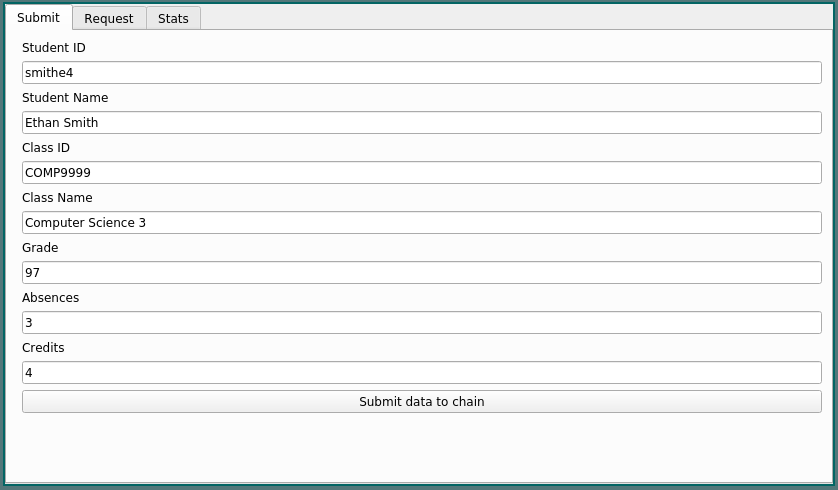
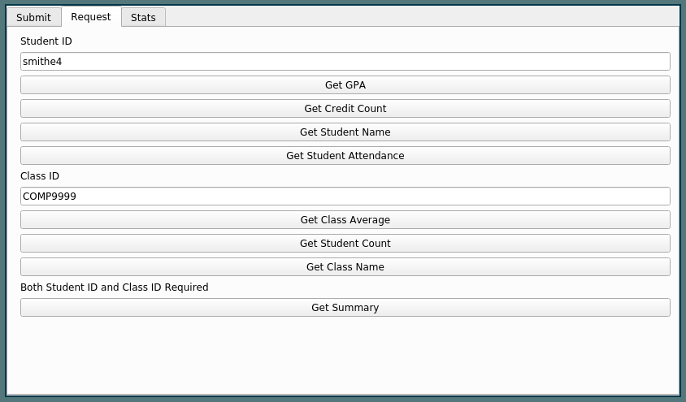
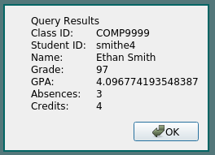
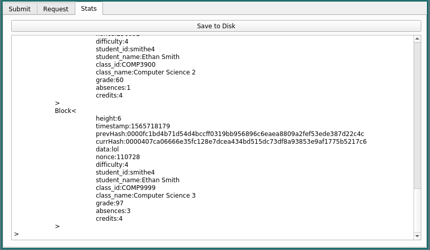

# Academic Chain

## Description
### What?
Academic Chain is an application designed to store and retrieve academic records for use in academic institutions. It allows faculty to append student and class information to a blockchain structure and allows for the retrieve this data or collect statistics about certain classes or student groups. 

### Why?
There are rarely cases where academic records need to be removed from a database. Because of this, a blockchain structure is perfect to store records of this type. Faculty can append information indefinitely and the record can follow students easily as they make their way through academia’s ranks. A record of this type would be useful for transfer students, or to corporations looking to vet new employees. 

### How?
A blockchain structure will be appended to as students complete their courses. A user interface will allow these students and faculty to search for data in these records and manipulate them. Some frameworks/libraries we plan to use are:

### Deliverables
#### Front end
PySide2 (Qt5 bindings for Python3)

#### Back end
Python3

#### Tools
Git
Vim

### Getting Started 
#### Run:
$ python3 gui.py

### Features
* Submit a student record
	* Student ID
	* Student Name
	* Class ID
	* Class Name
	* Grade
	* Number of Absences
	* Credit Count
* Request a student record
	* Get GPA
	* Get credit count
	* Get student name
	* Get attendance
	* Get academic summary
* Request a class record
	* Get class average
	* Get student count
	* Get class name
* View raw blockchain

### Demo

### Team Members
Ethan Smith
Prabha Neuprane
Shaheer Khawaja
